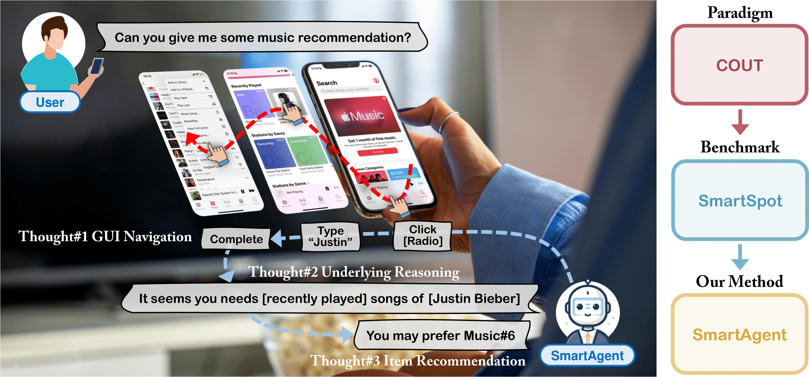
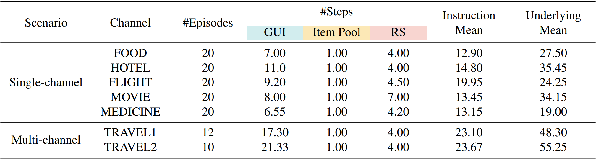
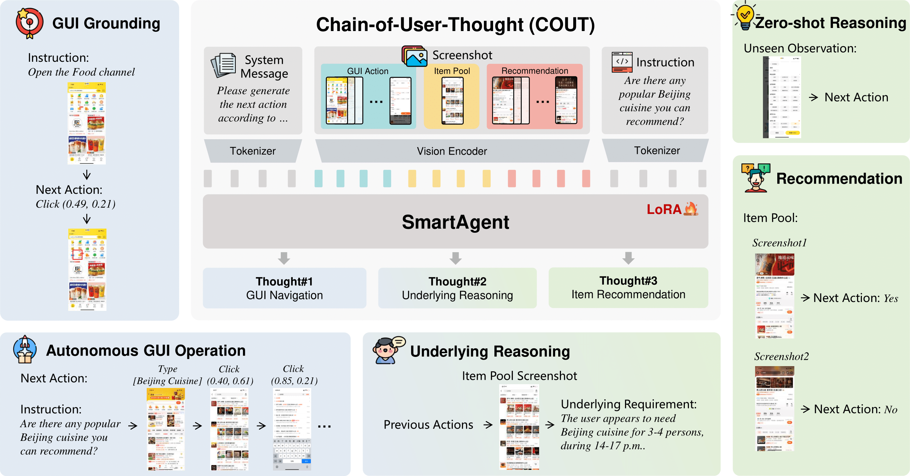
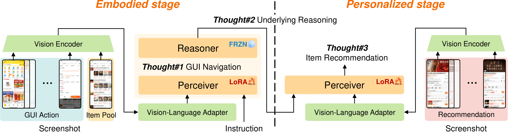

<p align="center" width="100%">
  
</p>


# SmartAgent: Chain-of-User-Thought for Embodied Personalized Agent in Cyber World
The official repository of our paper "[SmartAgent: Chain-of-User-Thought for Embodied Personalized Agent in Cyber World](https://arxiv.org/pdf/2412.07472)". We will release code and data upon paper notification.

# Blogs 🤗 
- Find SmartAgent in [Awesome-LLM-Reasoning](https://github.com/atfortes/Awesome-LLM-Reasoning)  with more brilliant works on LLM/MLLM reasoning!
- Find SmartAgent in [Multimodal Chain-of-Thought Reasoning: A Comprehensive Survey](https://arxiv.org/pdf/2503.12605) [[Github](https://github.com/yaotingwangofficial/Awesome-MCoT) ] with the latest Multimodal CoT reasoning techniques toward multimodal AGI!
- Find SmartAgent in [LLM-Agent-for-Recommendation-and-Search](https://arxiv.org/pdf/2503.05659) [[Github](https://github.com/tsinghua-fib-lab/LLM-Agent-for-Recommendation-and-Search) ] with more fascinating LLM agents inspiring the next-generation information retrieval!


# Chain-of-User-Thought (COUT) Reasoning Paradigm
We formulate COUT to achieve embodied personalized agent training in terms of three stages of thought. In Thought #1, according to a user's instruction, an agent performs GUI actions to search for an item pool. In Thought #2 with seeing the pool, the agent reasons underlying requirements behind the original instruction, as implied by the previous actions. In Thought #3, based on the underlying thought, the agent recommends items within the pool to complete the user's instruction. 

<p align="center" width="100%">
  
</p>
By leveraging user-oriented thoughts, this COUT could enable full-stage embodied personalized capabilities across various information systems. 

# SmartSpot Benchmark
The first environment supports full-stage embodied personalized evaluation.

<p align="center" width="100%">
  
</p>


# SmartAgent Model
The capabilities of SmartAgent from basic embodied operations to personalized reasoning.

<p align="center" width="100%">
  
</p>


Two-stage training paradigm of SmartAgent.

<p align="center" width="100%">
  
</p>

# Citation
Please consider citing our paper and staring this repo if you find SmartAgent helpful in your work, thanks!

```bib
@article{zhang2024smartagent,
      title={SmartAgent: Chain-of-User-Thought for Embodied Personalized Agent in Cyber World}, 
      author={Zhang, Jiaqi and Gao, Chen and Zhang, Liyuan and Li, Yong and Yin, Hongzhi},
      journal={arXiv preprint arXiv:2412.07472},
      year={2024}
}
```
